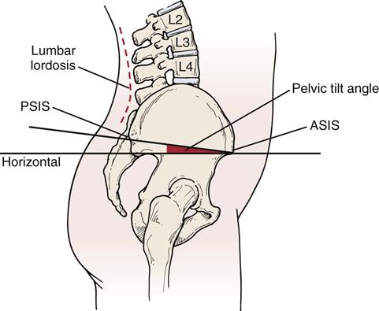

#  Posture Improver

This is a mobile app that detects the user’s posture using the device’s camera and recommends a set of exercises that could possibly improve their posture and reduce their pain. After scanning the posture for multiple days, the app generates time graphs
that the user can use to effortlessly visualize their progress.

## Postural problems

Posture Improver handles 3 of the most common postural problems:

* Head Forward
* Lordosis / Anterior Pelvic Tilt
* Rounded Shoulders

For classifying an image capture in one of the above categories, I am collecting points from the user's body using Google's [ML Kit Pose Detection API](https://developers.google.com/ml-kit/vision/pose-detection). 

After some research, I selected 3 points to form an angle for each of the problems above. The angles computed on the captured image are compared to standard values typically seen in healthy people.

  <table>
    <tr>
      <th>Head Forward</th>
      <th>Lordosis</th>
      <th>Rounded Shoulders</th>
    </tr>
    <tr>
      <td></td>
      <td></td>
      <td></td>
    </tr>
  </table>

Most of the points were already present on the Pose Detection API, however, the C7 point needed for handling Head Forward and Rounded Shoulders was missing. After some further research and testing on multiple subjects, I computed an approximation based on other points from the API:

 * C7.x = half the distance between nose and ears, as an offset from the shoulders x coordinate

 * C7.y = half the distance between the nose and shoulders on the Oy axis

## Workouts
If the app detects postural problems, the user is recommended a custom workout, created with their specific problem and severity in mind.

  

## Tracking progress
If the user scans their posture multiple times, time graphs are generated for individual problems. A combined graph is generated as well, where the user can see all their progress related to all the possible postural problems.

  

